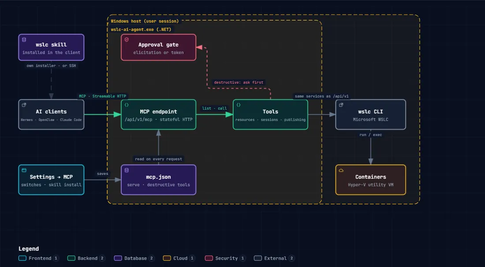
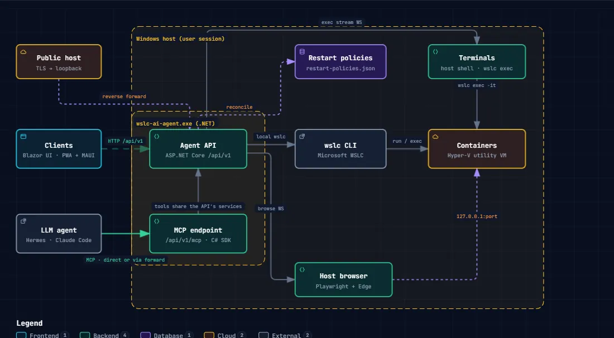

# WSLC AI Agent

A **local agent and MCP server for WSLC** (Windows Subsystem for Linux
Containers), with its skill included, so Claude, Hermes, OpenClaw and other
AI agents can operate your WSLC infrastructure: containers, images, volumes,
networks and sessions. Built for the age of AI agents, it also brings a web
dashboard and Windows and Android clients, to manage it all yourself from
anywhere. Destructive actions are off by default; switched on, each one
still asks your approval.

It is the small Windows process that sits next to `wslc`, talks to it for you,
and exposes what it knows over HTTP, in a browser, in native apps and through
the Model Context Protocol. Repository and namespaces are `wslc-agent`; the
products are **WSLC AI Agent** (the agent, `wslc-ai-agent.exe`) and
**WSLC AI Client** (the Windows and Android apps, `wslc-ai-client.exe`).

## Features

- **An MCP agent for WSLC, skill included for Claude, Hermes, OpenClaw,
  etc.**: 53 tools, the destructive ones off by default and asking your
  approval once switched on, and a skill installed with one click. One Windows program beside `wslc` that runs in
  the background of your Windows session, goes on with the browser and the
  apps closed, and serves the web interface, the clients
  and a REST API too. Per user, no administrator rights.
- **Easy container management with WSLC, MCP and skills**: containers,
  images, volumes, networks and sessions from one place; paste a `docker run`
  line to fill the form; live stats, a network map, restart policies kept by
  the agent. Or just tell your AI agent (below).
- **Manage from anywhere, you or your AI agents**: Claude, Hermes,
  OpenClaw, etc. connect over MCP from wherever they run, and so do you from
  a phone or across the internet. Not only the WSLC machine but its
  containers: open a console on the
  host or in any container, open a container's web page even when it is not
  published, and publish it on a public HTTPS name through a built-in nginx
  proxy.
- **Files** inside containers, images and volumes, with transfers that keep
  running when you leave.
- **Logs**: the agent's own, and every `wslc` command it ran.
- **A dashboard you design yourself**: live objects dragged onto a grid, a
  System and a User page, a landscape and a portrait view, kept on the agent
  for every client or on the device, alarms, and a fit for any screen.
- **Notifications** on Windows and Android.
- **Every client, one interface**: browser, Windows app, Android app and tray
  icon; several clients per agent, several agents per client.
- A **self-updating** agent and clients.

### Just tell your AI agent

Everything the app does, your AI agent (Claude, Hermes, OpenClaw, etc.) can
do too, through the agent's MCP server and its skill.

[](https://berpiztu.github.io/wslc-ai-agent/architecture/wslc-mcp.html)

▶ **[Explore it interactive](https://berpiztu.github.io/wslc-ai-agent/architecture/wslc-mcp.html)**

Ask in your own words:

```text
List all containers with their state and ports
Run this as is: docker run -d --name web -p 8080:80 nginx:latest
Show me the last 20 log lines of the web container
Show me the live CPU and memory of the database container
Pull alpine:latest and let me know when it finishes
Show me the network topology
Publish port 80 of the web container on web.example.com
Clean up the images that are not used
```

**Destructive actions are off by default**: removing, pruning, killing,
running a command inside a container, publishing and stopping a session are
not even offered to the AI agent until you switch them on in Settings → MCP
server. Switched on, each one still waits for your yes: the AI agent shows
what it is about to do and asks first. The last two examples above need
them on. More examples:
[docs/features.md](docs/features.md#or-just-tell-your-ai-agent).

Every feature, explained: [docs/features.md](docs/features.md).

## Architecture

[](https://berpiztu.github.io/wslc-ai-agent/architecture/wslc-overview.html)

▶ **[Explore it interactive](https://berpiztu.github.io/wslc-ai-agent/architecture/wslc-overview.html)**:
zoom, search, follow a route, light or dark. More:
[terminals](https://berpiztu.github.io/wslc-ai-agent/architecture/wslc-terminal.html),
[a container's page](https://berpiztu.github.io/wslc-ai-agent/architecture/wslc-networks.html),
[MCP](https://berpiztu.github.io/wslc-ai-agent/architecture/wslc-mcp.html).

The agent in the middle is the only thing that runs `wslc`: the clients call
its API, AI agents its MCP endpoint, and a public host reaches it through a
reverse forward. The same diagrams open from any screen of the app (the
architecture button).

| Project | Role |
|---|---|
| `WslcAgent.Server` | ASP.NET Core agent: runs `wslc`, exposes `/api/v1`, serves the UI, hosts the MCP endpoint. Ships as `wslc-ai-agent.exe`. |
| `WslcAgent.UI` | The one user interface: Razor components on [MudBlazor](https://mudblazor.com/). |
| `WslcAgent.Web` | Blazor WebAssembly host of the UI, served by the agent, installable as a PWA. |
| `WslcAgent.App` | .NET MAUI Blazor Hybrid host of the UI for Windows and Android (`wslc-ai-client.exe`, `ai.berpiztu.wslcagent`). |
| `WslcAgent.ApiClient` | Contracts and typed client for `/api/v1`, shared by every host. |
| `WslcAgent.Mcp` | MCP tools (official C# SDK), hosted by the server. |
| `Berpiztu.Dashboard` | The dashboard and its designer, a Razor class library on MudBlazor that knows nothing of WSLC. |
| `WslcAgent.Tray` | The agent's icon beside the clock (`wslc-ai-agent-tray.exe`): its page in a window, its menu and its notifications. |
| `WslcAgent.Toasts` | The agent's notifications as Windows toasts, shared by the tray and the Windows client. |

One UI, one language, one API contract.

## Built with

- [.NET 10](https://dotnet.microsoft.com/) and ASP.NET Core minimal APIs
- [Blazor WebAssembly](https://learn.microsoft.com/aspnet/core/blazor/) for the UI
- [MudBlazor](https://mudblazor.com/) as the component library and look
- [MCP C# SDK](https://github.com/modelcontextprotocol/csharp-sdk) for the MCP server
- [.NET MAUI](https://learn.microsoft.com/dotnet/maui/) Blazor Hybrid for the native apps
- [WiX Toolset](https://wixtoolset.org/) for the Windows installers
- [xterm.js](https://xtermjs.org/) for the terminals

## Quick start

Needs Windows 11 and **WSLC**, generally available since WSL 3.0.1: install
the [latest WSL release](https://github.com/microsoft/WSL/releases/latest). The agent works with 2.9.13 or later.

Two ways in:

- **[Install it](#install-it)**: download the installers of the latest
  release and use the agent. Nothing to build.
- **[Build it yourself](#build-it-yourself)**: clone the repository, build and
  run it from source, to change it or to contribute.

### Install it

> [!WARNING]
> **Our installers are not digitally signed.** We recommend building your own
> ([Build it yourself](#build-it-yourself)): you then run exactly the code you
> read. For convenience we publish ready-made installers too, and Windows and
> your browser will warn about them because nobody signed them:
>
> - **The browser**, when downloading ("isn't commonly downloaded" or similar):
>   open the download's **…** menu → **Keep** → **Show more** → **Keep anyway**.
> - **Windows**, when opening it ("Windows protected your PC"): **More info** →
>   **Run anyway**.
>
> The PowerShell download below avoids the browser's warning.

**1. Download the agent's installer**, `wslc-ai-agent.msi`, from the
[latest release](https://github.com/berpiztu/wslc-ai-agent/releases/latest),
or from PowerShell:

```powershell
Invoke-WebRequest https://github.com/berpiztu/wslc-ai-agent/releases/latest/download/wslc-ai-agent.msi -OutFile "$env:USERPROFILE\Downloads\wslc-ai-agent.msi"
```

**2. Install it.** It installs for your user only, with no administrator
rights; its wizard asks for the address and port the agent listens on
(`127.0.0.1` and `8069` unless you change them) and for its package folder
([How to update](#how-to-update)). If Windows warns that the installer is
from an unknown publisher: **More info → Run anyway**.

```powershell
Start-Process "$env:USERPROFILE\Downloads\wslc-ai-agent.msi"
```

**3. Open it.** The agent starts at once, and at every logon from then on;
its icon sits beside the clock. All is well when http://127.0.0.1:8069 opens
the dashboard:

```powershell
Start-Process http://127.0.0.1:8069
```

**4. Optional: the clients and your AI assistant.**

- **Windows client**: `wslc-ai-client.msi`, and **Android client**:
  `wslc-ai-client.apk`, from the same
  [release](https://github.com/berpiztu/wslc-ai-agent/releases/latest). The
  Windows client connects to the agent on the same machine unless its
  installer is told another address; either client changes it in
  **Settings → This client**.
- **Claude Code** (or any MCP client) reaches the agent's tools with:

```powershell
claude mcp add --transport http wslc-agent http://127.0.0.1:8069/api/v1/mcp
```

To reach the agent from another machine or from the internet:
[docs/developer/remote-access.md](docs/developer/remote-access.md).

### Build it yourself

Run each line in PowerShell, one at a time, and check what it shows before
going on to the next.

**1. Let PowerShell run the scripts** (once per user; answer `Y`).

```powershell
Set-ExecutionPolicy -Scope CurrentUser RemoteSigned
```

**2. Clone the repository.** No git yet? Install it first, then open a new
terminal:

```powershell
winget install --id Git.Git -e
```

Then clone:

```powershell
git clone https://github.com/berpiztu/wslc-ai-agent.git
```

**3. Go into it.**

```powershell
cd wslc-ai-agent
```

Downloaded the ZIP from GitHub instead of cloning? Windows marks every file
of it as coming from the internet, and PowerShell refuses to run the scripts
("is not digitally signed"). Unblock them once, from the folder you unzipped:

```powershell
Get-ChildItem -Recurse | Unblock-File
```

**4. Check what this machine needs.** It installs nothing. All is well when
the last line is green: **Ready to build**, and you can go on to step 5.
Otherwise, under every missing piece, it prints the command that installs
it and the section of
[docs/developer/prerequisites.md](docs/developer/prerequisites.md) that
explains it (VS Code, Visual Studio or no IDE).

```powershell
.\check-prereqs.ps1
```

**Install what is missing, all at once.** Windows asks once for
administrator rights, and it goes on in an administrator window of its own:
the .NET SDK and its workloads, the JDK, the Android SDK, WSL, in the right
order.

```powershell
.\install-prereqs.ps1
```

When it ends, **close every terminal and VS Code and open them again** (a
terminal only sees what was installed before it started; restart Windows
if it says so), and run `.\check-prereqs.ps1` again. You can also run each
printed command yourself, one at a time.

**5. Check the private files.** They are optional (the signing key, push
notifications) and a fresh clone has none. All is well when the last line is
green: **Nothing broken**; `[absent]` only switches off what it names.

```powershell
.\check-private.ps1
```

**6. Build and test**, as CI does. All is well when the tests pass and it
ends in **Done.** The first run downloads the packages and takes a few
minutes.

```powershell
.\build.ps1
```

**7. Run the agent.** All is well when http://127.0.0.1:8070 opens the
dashboard. `Ctrl+C` stops it.

```powershell
.\start-agent.ps1
```

Every step, what it shows and what to do when it shows something else:
[docs/developer/getting-started.md](docs/developer/getting-started.md).
The signing key and the Firebase files, when you want signed APKs or push
notifications: [docs/developer/private-files.md](docs/developer/private-files.md).

## How to update

The agent updates itself, and offers its clients their updates, from its
**package folder**: put newer installers there and, with **Auto update** on
(Settings → Update), the rest follows.

- **Installed a release?** The package folder is `C:\Berpiztu\wslc-ai-agent`
  unless you chose another when installing: copy the new
  `wslc-ai-agent.msi`, `wslc-ai-client.msi` and `wslc-ai-client.apk` there.
- **Built it yourself?** The agent takes its updates from your clone's
  `dist`, where the build scripts put them. To keep it from updating itself
  every time you build, turn **Auto update** off in Settings → Update.

The package folder can be changed in Settings → Update at any time. How it
all works, step by step: [docs/updating.md](docs/updating.md).

## Scripts

All scripts live in the repository root and work from any current directory.

| Script | What it does |
|---|---|
| `check-prereqs.ps1` | What the machine needs to build, test, run and package, and the command that installs what is missing. Changes nothing. |
| `install-prereqs.ps1` | Install everything `check-prereqs.ps1` finds missing, in order, after one administrator prompt. |
| `check-private.ps1` | The private files this checkout has and what each enables, without printing a secret. |
| `deploy-release.ps1` | Publish a release: raise the repository's version above every build, build the three installers at it, commit, tag and push; `-Publish` also creates the GitHub release ([releasing.md](docs/developer/releasing.md)). |
| `start-sandbox.ps1` | A clean Windows in Windows Sandbox, to try the Quick start as a new user ([clean-machine-test.md](docs/developer/clean-machine-test.md)). |
| `build.ps1` | Restore, build, test: what CI runs. |
| `start-agent.ps1` | Build and run the agent in Development on http://127.0.0.1:8070. `-Port`, `-NoBuild`, `-Watch` (dotnet watch, hot reload on save). |
| `debug-client.ps1` | Debug build of the Windows client and launch it against `-AgentUrl` (default the local agent). |
| `debug-android.ps1` | Debug build of the Android client, deploy to an emulator or phone and launch it against `-AgentUrl` (default `http://10.0.2.2:8070/`, the host as seen from the emulator). |
| `debug-phone.ps1` | `debug-android.ps1` aimed at the phone on the USB cable: built for its architecture, and launched against the PC's agent through the cable. |
| `build-agent-installer.ps1` | `dist\wslc-ai-agent.msi`: self-contained agent with the UI inside. |
| `build-client-installer.ps1` | `dist\wslc-ai-client.msi`: the Windows client. |
| `build-client-apk.ps1` | `dist\wslc-ai-client.apk`, arm64-v8a, signed. `build-client-apk-full.ps1` bundles every ABI. |

The three installer scripts raise the version at every build, in
`private\version.props` (never tracked), so each installer is newer than the
last and a build changes no tracked file; `-NoBump` builds the same version
again. The version in the repository is the last release's, changed only when
one is published.

Without the scripts: `dotnet build`, `dotnet test`,
`dotnet run --project src/WslcAgent.Server` from the repository root. A
Production run must come from `dotnet publish` (or the MSI); an unpublished
Production run cannot serve the UI.

`GET /api/v1/health` reports the version; the MCP endpoint is `/api/v1/mcp`
(Streamable HTTP). To try it from Claude Code:

```powershell
claude mcp add --transport http wslc-agent http://127.0.0.1:8069/api/v1/mcp
```

The agent installer asks for the bind address and port (defaults 127.0.0.1
and 8069; development runs on 8070). Installer settings are also MSI properties, `WSLC_BINDHOST` and
`WSLC_AGENTPORT` for the agent and `WSLC_AGENTURL` for the client, e.g.
`msiexec /i dist\wslc-ai-agent.msi WSLC_AGENTPORT=8069`. The agent MSI
registers a per-user logon task that starts the agent right away and at every
logon, because wslc only works inside a user session. Android APKs are
signed with a key kept outside the repository, in `private/`; see
[docs/developer/private-files.md](docs/developer/private-files.md).

## Contributing

Issues and pull requests are welcome: [CONTRIBUTING.md](CONTRIBUTING.md) says
how to build it, what a pull request needs and the rules the code keeps, and
[AGENTS.md](AGENTS.md) gives the same rules to AI coding agents. Security
problems go privately, through [SECURITY.md](SECURITY.md). Everyone follows
the [code of conduct](CODE_OF_CONDUCT.md).

## License

[MIT](LICENSE). Copyright (c) 2026 Berpiztu. Third-party components and
their licenses are listed in [THIRD-PARTY-NOTICES.md](THIRD-PARTY-NOTICES.md).

WSLC AI Agent is built by [Berpiztu](https://github.com/Berpiztu), a team
that builds AI agents and the tools they work with, and the team behind
[Virtus](https://github.com/berpiztu/virtus).
